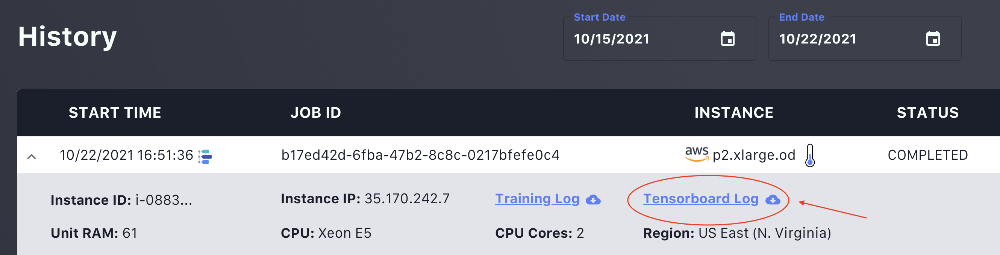

# aibro.Comm

## available_machines()

```python
def available_machines()

# Sample Output:
# Machine Id: g4dn.12xlarge  GPU Type: 4xT4     num_vCPU: 48    cost: 1.43      capacity: 2 availability: 32.0%
# Machine Id: g4dn.12xlarge.od GPU Type: 4xT4     num_vCPU: 48    cost: 3.91      capacity: 3 availability: 100%
# Machine Id: g4dn.16xlarge  GPU Type: 1xT4     num_vCPU: 64    cost: 1.31      capacity: 2 availability: 13.0%
# Machine Id: g4dn.16xlarge.od GPU Type: 1xT4     num_vCPU: 64    cost: 4.35      capacity: 2 availability: 100%
# Machine Id: g4dn.4xlarge   GPU Type: 1xT4     num_vCPU: 16    cost: 0.36      capacity: 8 availability: 86.0%
```

This method is used to grab machine information from the [AIbro Marketplace](https://aipaca.ai/marketplace).

Two concepts in marketplace:

- **Capacity**: the number of instances that are requestable.
- **Availability**: the success probability of instance request.

## open_tensorboard()

```python
def open_tensorboard(
    path: str,
    directory_to_save_log: str="."
)
```

This method can open encoded Tensorboard logs from [Job Hisotry](https://aipaca.ai/jobs) and start a Tensorboard server.


### Parameters

**path**: _str_<br/>
File path to the downloaded tensorboard log.

**directory_to_save_log**: _str_ = "."<br/>
File path to save the decoded tensorboard log.

## send_message()

```python
def send_message(
    email: str,
    feedback_message: str,
    category: str = "random"
)
```

This method sends feedback to AIbro support directly.

### Parameters

**email**: _str_<br/>
Registered email address.

**feedback_message**: _str_<br/>
Anything you want to say to us.

**category**: _str_ = "random"<br/>
Category of the message. The category should be one of ['random', 'feature_request', 'bug report']
